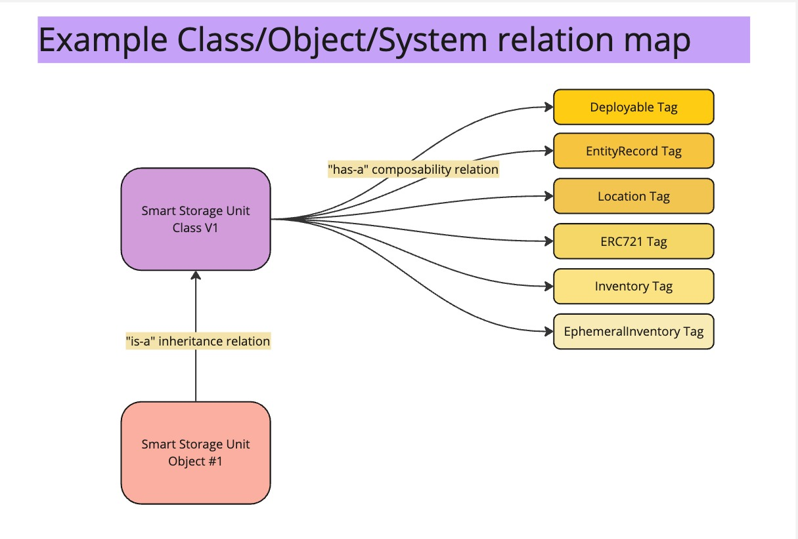
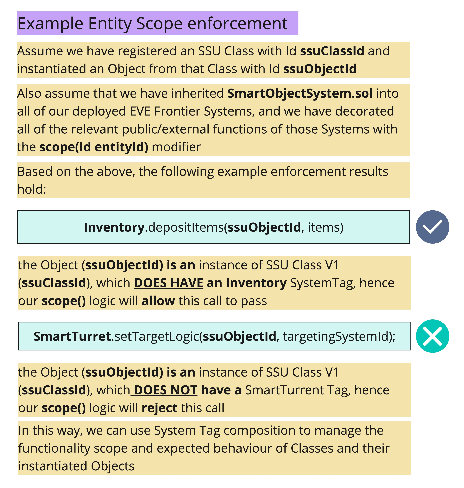
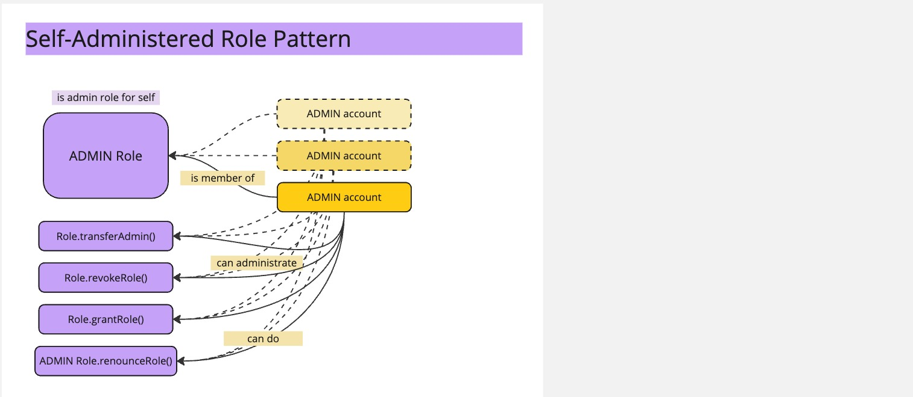
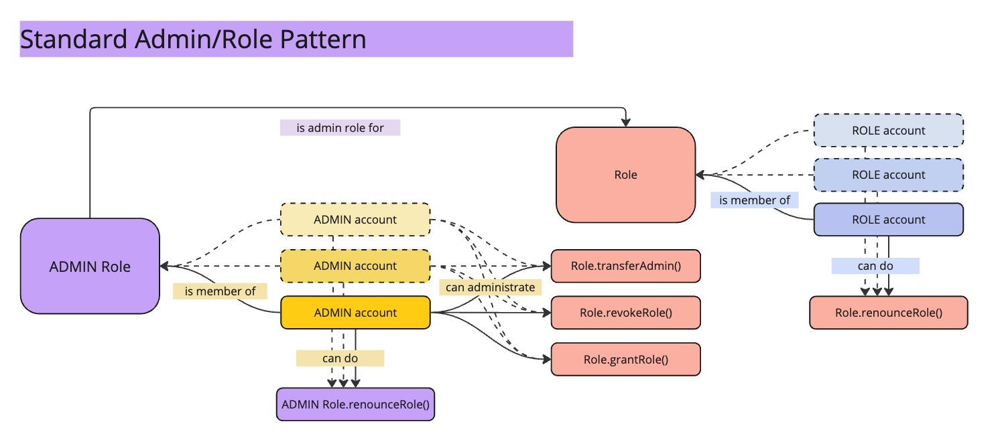

# Smart Object Framework Documentation

### Overview

The Smart Object Framework (SOF) is a comprehensive abstraction layer built on top of the [MUD Framework](https://github.com/latticexyz/mud) that provides structured on-chain entity management, system scoping, and execution context tracking.  while maintaining security and clear permission boundaries.

### Design Goals

- Expose call context variable tracking across the entire execution call stack for the lifetime of a transaction
- Structured on-chain entity management through Classes and Objects
- Enabling complex extensible and composable entity interactions through a flexible system association model
- Defining clear object functionality boundaries and expected behavior through system association scoping and enforcement
- Define granular, flexible, and clear access boundaries through role management and access control configurations

### Core Components

#### Execution Context

- Tracks system ResourceId, function selector, `msg.sender`, and `msg.value` information for each World system call
- Maintains call stack history and integrity for the lifetime of a transaction
- Provides context validation at each call in the execution
- Uses transient storage to do so

#### Entity Management

- Classes define templated Object "types" and and can be configured  to allow MUD system access to operate on those Objects via system tagging
- Objects instantiate Classes and inherit system associations
- System Tags create explicit access relationships between systems, Classes and Objects

#### Entity System Scoping

- Enforces System-to-Entity relationships
- Validates Entity centric execution boundaries

#### Entity Based Access Control

- Configure and enforce Class or Object level access control
- Provide robust and flexible environment for full access case coverage

## Execution Context

The Execution Context system extends MUD's [World.sol](https://github.com/latticexyz/mud/blob/main/packages/world/src/World.sol) and [System.sol](https://github.com/latticexyz/mud/blob/main/packages/world/src/System.sol) contracts with robust call context tracking and validation. It provides a way to securely track and verify the original caller, value, and system information throughout the execution stack.

### Key Additions Over the Base MUD Implementation

#### Extended Call Context Tracking

- Maintains context tracking for the full execution call stack
- Allows accessing context values at any call depth
- Provides total call count tracking

#### Alternate Context Validation

- Ensures the World entry point interface is used for all non-root system calls
- Uses alternate transient storage pattern (rather than `calldata`) for context data tracking and enforcement 

### Context Tracking

Within the World's transient storage a call stack of ordered world calls is built for the entire transaction execution. 

To access the call stack depth, there is an exposed function on the World contract for fetching the current call stack depth count:

```solidity
function getWorldCallCount() public view returns (uint256)
```

For each World call in the call stack the following context values are tracked:

	- System ResourceId of the current system being called
	- Function Selector of the target function to be executed
	- call msg.sender
	- call msg.value

These values can be retrieved for the **current** call by calling the following getter on the World contract:

```solidity
function getWorldCallContext() public view returns (ResourceId, bytes4, address, uint256)
``` 

Or can be fetched for **previous** calls in the call stack by using:

```solidity
function getWorldCallContext(uint256 callCount) public view returns (ResourceId, bytes4, address, uint256)
```

**Note:** calling the above with a `callCount` that exceed the current `getWorldCallCount()` value will result in producing `null` return values.

### Context Validation

The `context` modifier ensures the following:

- The current non-root system (and targeted function) is being called via one of the basic `World.sol` exposed entry points ([world.call()](https://github.com/latticexyz/mud/blob/b8afc07a8fab2a504943e7329ee80413d71d4d3f/packages/world/src/World.sol#L347), [world.callFrom()](https://github.com/latticexyz/mud/blob/b8afc07a8fab2a504943e7329ee80413d71d4d3f/packages/world/src/World.sol#L362), or [world.fallback()](https://github.com/latticexyz/mud/blob/b8afc07a8fab2a504943e7329ee80413d71d4d3f/packages/world/src/World.sol#L414))
- Call context values will be tracked in transient storage for the current call (as long as it is a state changing execution, i.e., a non-`view`/`pure` world call)


### Usage

##### Example `SmartObjectFramework` system integration with the `context` modifier and Execution Context getter usage -

```solidity
contract MySystem is SmartObjectFramework {

	IWorldWithContext world = IWorldWithContext.(_world());
	
    function myFunction() public context {
        // Access current call msg.sender
        address sender = _callMsgSender();
        
        // Access current call msg.value
        uint256 value = _callMsgValue();
        
        // Get full current call context
		(ResourceId systemId, bytes4 selector, address sender, uint256 value) = world.getWorldCallContext();

		// Get current call stack depth
		uint256 currentCallCount = world.getWorldCallCount();
		
		uint256 selectedCall = 1; // 1 is the intial entry call
		
		// Access select previous call msg.sender
		address selectedCallSender = _callMsgSender(1);
		
		// Access select previous call msg.value
		uint256 selectedCallValue = _callMsgValue(1);
		
		// Get previous full call context
		((ResourceId selectedCallSystemId, bytes4 selectedCallSelector, selectedCallSender, selectedCallValue) = world.getWorldCallContext(1);
    }
}
```
### Key Contracts

- [WorldWithContext.sol](src/WorldWithContext.sol) - Extends the MUD `World.sol` contract with full execution context tracking
- [SmartObjectFramework.sol](src/inherit/SmartObjectFramework.sol) - Base inheritable contract which extends the MUD `System.sol` contract with the `context` modifier for strict context enforecement, as well as context based quality of life getters: `_callMsgSender()`, `_callMsgValue()`, and `_callDataWithoutContext()`

## Entites, System Tags, and Scoping

[EntitySystem.sol](src/namespaces/evefrontier/systems/entity-system/EntitySystem.sol) provides a robust framework for creating and managing Classes and Objects with unique [Id](src/libs/Id.sol)s, as well as the ability to manage Class associated system tags via [TagSystem.sol](src/namespaces/evefrontier/systems/tag-system/TagSystem.sol). This structure allows for granular and composable configuration of entity functionality and behavior through system access enforcement and entity relationships.

In conjunction to system-to-class tagging, the `scope` modifier implements a powerful permission model that connects MUD Systems to Classes and Objects through this tagging mechanism. The `scope` modifier ensures systems can only operate on entities (Classes/Objects) which they are explicitly tagged to handle, thereby clearly defining the boundaries of functionality, properties, and behavior for any Object or Class.

This scoping model provides a robust and efficient way to manage system permissions (with regards to entities) and enables functional composability across Classes and Objects while maintaining clear relationships and inheritance patterns.




### Entity Types

- Classes: Template "type" entities that are associated with a specific "scope" of associated MUD systems.
- Objects: Instances of Classes that inherit any System Tag associations

### Tag Types

- SystemTags: Representative tags that connect systems to Classes for adding and enforcing composable system functionality and properties

### The `scope` modifier

- a modifier that can be inherited from [SmartObjectFramework.sol](src/inherit/SmartObjectFramework.sol) which is intended to be implemented on any function that wishes to operate on entites with system scope restrictions

### Key Features

#### System to Class composability

- Explicit system-to-class relationship setting to configure unique  and encaptulated groupings of functionality in a composable manner 
- Any associated (tagged) system has access to operate on a Class (and any of its derived Objects) via the `scope `modifier

#### System to Entity access control (via the `scope` modifier)

- Class-level system access enforcement
- Class-based system permission groupings
- Object system permission inheritance 

#### Flexibility

- Dynamic tag management (for Class reconfiguration)
- Efficient bulk Object management (via Class configuration)

#### Class to Object instantiation

- Objects are instantiated from pre-defined Classes
- Objects inherit the system scope of thier Class

### How Entity System Scoping Works

1. Tag Assignment (configuring system-to-entity associations)

	- Systems are tagged to Classes
	- Classes maintain list of thier tagged Systems
	- For each SystemTag a list of tagged Classes is maintained
	- SystemTag to Class relation data is stored in a mapping table

2. Scope Validation (the `scope` modifier)

	- Checks entity type (Class/Object)
		- For Classes: Verifies the Class is tagged to the system being called
		- For Objects: Verifies the Object's parent Class is tagged to the system being called
		- Reverts if a called system is not tagged appropriately
	- Inheritance
		- Objects inherit all system associations from their Class
		- Changing Class tags affects all Objects of that Class
		- Provides efficient system permission management at the Class level
		- Class owners control the system scope for all Objects of that Class



### Usage

The following are example code snippets to use the various Entity, Tag, and Scoping functionalities.

##### Creating a Class

```solidity
// Set the basic World call interface
IWorldKernel world = IWorldKernel(worldAddress);
StoreSwitch.setStoreAddress(worldAddress); // required for IdLib usage

// Define a unique (non-registered) classId
Id myClassId = IdLib.encode(ENTITY_CLASS, bytes30("MY_UNIQUE_CLASS_ID");

// Define system tags for a Class based on existing MUD Systems registered on the World
// In this example our Class will have access to inventory and trade system functionalities
Id[] memory systemTags = new Id[](2);
systemTags[0] = IdLib.encode(TAG_SYSTEM, inventorySystemId.getResourceName());
systemTags[1] = IdLib.encode(TAG_SYSTEM, tradeSystemId.getResourceName());

// Register the class with initial system tags
world.call(
	entitySystemId,
	abi.encodeCall(IEntitySystem.registerClass, (myClassId, systemTags)
);
// the World entry point call msg.sender will be set as the Class owner
```

##### Ad hoc Class Tag Management

```solidity
// Set the basic World call interface
IWorldKernel world = IWorldKernel(worldAddress);
StoreSwitch.setStoreAddress(worldAddress); // required for IdLib usage

Id myClassId = IdLib.encode(ENTITY_CLASS, bytes30("MY_UNIQUE_CLASS_ID");

Id newSystemTagId = IdLib.encode(TAG_SYSTEM, newSystemId.getResourceName());

// Add single system tag
world.call(
	tagSystemId,
	abi.encodeCall(ITagSystem.setSystemTag, (myClassId, newSystemTagId)
);

Id[] memory additionalSystemTags = new Id[](2);
systemTags[0] = IdLib.encode(TAG_SYSTEM, additionalSystemId.getResourceName());
systemTags[1] = IdLib.encode(TAG_SYSTEM, additionalSystemId2.getResourceName());

// Add multiple system tags
world.call(
	tagSystemId,
	abi.encodeCall(ITagSystem.setSystemTags, (myClassId, additionalSystemTags)
);

Id oldSystemTagId = IdLib.encode(TAG_SYSTEM, oldSystemId.getResourceName());

// Remove system tag
world.call(
	tagSystemId,
	abi.encodeCall(ITagSystem.removeSystemTag, (myClassId, oldSystemTagId)
);

```

##### Instantiating an Object from a Class

```solidity
// Set the basic World call interface
IWorldKernel world = IWorldKernel(worldAddress);
StoreSwitch.setStoreAddress(worldAddress); // required for IdLib usage

Id myClassId = IdLib.encode(ENTITY_CLASS, bytes30("MY_UNIQUE_CLASS_ID");

// Define a unique objectId
Id myObjectId = IdLib.encode(ENTITY_OBJECT, bytes30("MY_UNIQUE_OBJECT_ID");

);

// Instantiate object from class
world.call(
    entitySystemId,
    abi.encodeCall(IEntitySystem.instantiate, (myClassId, mtObjectId)
);
```

##### Integrate `scope` modifier

```solidity
contract MySystem is SmartObjectFramework {
    // Enforces that the current system must be tagged to entity
    function operateOnEntity(Id entityId) public context scope(entityId) {
        // Function can only execute if MySystem is tagged to:
        // - a Class (if entityId is a Class)
        // - an Object's Class (if entityId is an Object)
    }
}
```
### Key Contracts

- [EntitySystem.sol](src/namespaces/evefrontier/systems/entity-system/EntitySystem.sol) - Exposes Class and Object management functionality
- [TagSystem.sol](src/namespaces/evefrontier/systems/tag-system/TagSystem.sol) - Exposes functionality for adding/removing system-to-class associations via System Tags
- [SmartObjectFramework.sol](src/inherit/SmartObjectFramework.sol) - Base inheritable contract which extends the MUD `System.sol` contract with the `scope` modifier for  associated system calling enforcement

## Role Management

The Role Management system provides hierarchical role-based access control through the [RoleManagementSystem.sol](src/namespaces/evefrontier/systems/role-management-system/RoleManagementSystem.sol) contract. It enables granular permission management for Classes and Objects through role membership and administration.

**NOTE:** the `RoleAccessManagement` functionality is a standalone MUD System which can be used for other on-chain role/membership patterns (for example, it could be used for EVE Frontier Tribe membership tracking, DAO role management, and many other use cases). However, we are using it in conjunction with the `access` modifier and the `AccessConfigSystem` logic, to manage access control roles.

### Key Features

#### Role Creation and Administration

- Roles can be created with designated admin roles
- Self-administered roles (where role = admin) are supported
- Role creators automatically become members of self-administered roles
- Only admin role members can manage other roles

#### Role Membership Management

- Grant role membership to accounts
- Revoke role membership from accounts 
- Users can renounce their own role membership


### How Role Management Works

1. Role Creation
   - Roles are created with an assigned admin role
   - Admin roles must exist before being assigned (unless self-administered)
   - When self-administered roles are created the calling account is automatically granted membership to the role
   
2. Role Administration
   - Only admin role members can:
     - Grant role memberships to the administered role
     - Revoke role membership from the administered role
     - Transfer role administration to another admin role
   - However, at any time a role member can renounce their own role





### Usage

##### Creating a Role

```solidity
// Create a self-administered role (role is its own admin)
world.call( // caller is auto-added as a member of the role
    roleManagementSystemId,
    abi.encodeCall(IRoleManagementSystem.createRole, (adminRole, adminRole))
);

// Create a role administered by another role
world.call( // caller MUST be a member of adminRole
    roleManagementSystemId,
    abi.encodeCall(IRoleManagementSystem.createRole, (newRole, adminRole))
);
```

##### Managing Role Membership

```solidity
// Grant role to account
world.call( // caller must be a member of admin
    roleManagementSystemId,
    abi.encodeCall(IRoleManagementSystem.grantRole, (role, account))
);

// Revoke role from account
world.call( // caller must be a member of admin
    roleManagementSystemId,
    abi.encodeCall(IRoleManagementSystem.revokeRole, (role, account))
);

// Account renouncing their own role
world.call( // caller address must match callerConfirmation
    roleManagementSystemId,
    abi.encodeCall(IRoleManagementSystem.renounceRole, (role, callerConfirmation))
);
```

##### Managing Admin Transfer

```solidity
// Transfer admin to new admin role
world.call( // caller must be a member of the current admin role
    roleManagementSystemId,
    abi.encodeCall(IRoleManagementSystem.transferRoleAdmin, (role, newAdminRole))
);
```

## Access Rule Enactment & Configuration

The Access Configuration system provides granular access control configuration through [AccessConfigSystem.sol](src/namespaces/evefrontier/systems/access-config-system/AccessConfigSystem.sol). It enables MUD System namespace owners to define and enforce access control logic for any World registered MUD System and function. 

Access configuration is only triggered and enforced if the **target** (the System/function being accessed) implements the `access` modifier.

If the `access` modifier is included in a function's implementation, then the `SmartObjctFramework` will check to see if there is any access logic configured for that target and if the access enforcement toggle is switched on. 

Only when the above three conditions are satified will the access logic for a function call be triggered.

### Key Features

#### Dynamic Access Control

- **Namespace-owner controlled configuration** - System namespace-owners are the only ones allowed to configure access rules for each System
- **Configure access logic per system function** - provides fine grained access control for each call path in a World
- **Enable/disable access enforcement at runtime** - live access enforcement toggling (turn access on/off at any time)
- **Flexible System-level access management** - the abitlity to map **any** access system function to **any** target system function

#### Access Logic Flexibility
- Support for complex access rule patterns with the following available data:
   - **Entity level access rule execution** - by passing the `entityId` (Class or Object) to the `access` modifier, builders can implement access rules for a specific Class of objects, or individual Objects themselves without having to deploy new sets of contracts
	- **Execution Context values** - a builder can use the execution context call stack values to decide exactly which callers and which call paths are allowed for a target. The following is available for any call depth:
		-  `systemId`,
		-  `functionId`,
		-  `msg.sender`
		-  `msg.value`
	- **Function Parameters** - the target function parameter `calldata` is avaiable, allowing for custom usage in access rule building (after `abi.decoding`the parameter values)

With the above available data, complex and bespoke access rules can be built for nearly any consideration. 

**NOTE:** as logic patterns emerge in the development space, builders can easily point to other pre-existing access logic deployments for thier own configurations, minimizing the costs of access logic managment when possible.

### How Access Configuration Works

1. Implementing the `access` modifier on the target function:
  - the `access` modifier accepts an `entityId` (can be a `classId`, `objectId`, or `Id.wrap(bytes32(0))`
  - `classId` to be used for Class level access rules. e.g., when a Class "owner" (or similalry approved account) should be checked for access, or when a specific set of System addresses are allowed for Class level access (beyond the normal `scope` rules)
  - `objectId` to be used for Object level access rules (or rules that are set for the parent Class of the Object). e.g., when an Object "owner" (or similalry approved account) should be checked for access, or Object specific System access (beyond the normal `scope` rules) Or in cases where access needs to be checked against th Object's parent Class.
  - `Id.wrap(bytes32(0))` to be used when Class/Object considerations are not relevant. This kind of configuration treats the `access` modifier as a "normal" access rule. e.g. when there is no `objectId`/`classId` in the target function call, or when you want access rules to trigger uniformly regardless of the Object/Class involved.

2. Access Rule Building

  - Access rules are built and deployed in seprate MUD Systems.
  - Access rule functions can ONLY be implemented as `view`/`pure` (staticcall) functions.
  - Access rule functions must be `public` and accept the following parameters:
  - `Id entityId` - the `entityId` passed into the `access` modifier from the target function call
  - `bytes memory targetCallData` - the `calldata` containing the parameter values of the target function call
  - Access rule functions MUST NOT return any values and SHOULD revert when an access rule fails.

3. Access Configuration/Enforcement
 - Target system (the System to enforce access upon) must be registered in the MUD World
 - Access system (the System housing the access logic itself) must be registered in the MUD World
 - Only target namespace owners can configure access.enforcement for thier Systems/functions
 - Access configuration simply maps the target function to an access function that is to be called when access enforcement is enabled
 - Access Enforcement toggles the access enforcement flag on/off to set the access rule in an active state (or not)

### Usage

##### Adding the `access` modifier to a function

```solidity
contract MySystem {
  function myFunction(Id objectId, uint256 param2) access(objectId) public {
    // do object access restricted stuff here
    MyObjectTable.setParam2(objectId, param2);
  }
}
```

##### A simple access rule implementation

```solidity
contract MyAccessSystem {
	function myAccessFunction(Id objectId, bytes memory myFunctionParamData) public view {
		if(objectId != ERC721.owner(objectId) {
			revert MyAccess_NotTokenOwner();
		}
		(,uint256 param2) = abi.decode(myFunctionParamData, (Id, uint256));
		if(param2 != 2) {
			revert MyAccess_Param2RequirementNotMet();
		}
	}
}
```

##### Configuring Access Control

```solidity
// Configure access for a system function (configuring always re-sets the enforcement flag to false)
world.call( // caller must be the namespace-owner of MySystem's namespace
    accessConfigSystemId,
    abi.encodeCall(
        IAccessConfigSystem.configureAccess,
        (
            mySystemId,
            IMySystem.myFunction.selector,
            myAccessSystemId,
            IMyAccessSystem.myAccessFunction.selector
        )
    )
);
```

##### Managing Access Enforcement

```solidity
// Enable access enforcement
world.call( // caller must be the namespace-owner of MySystem's namespace
    accessConfigSystemId,
    abi.encodeCall(
        IAccessConfigSystem.setAccessEnforcement,
        (mySystemId, IMySystem.myFunction.selector, true)
    )
);

// Disable access enforcement
world.call( // caller must be the namespace-owner of MySystem's namespace
    accessConfigSystemId,
    abi.encodeCall(
        IAccessConfigSystem.setAccessEnforcement,
        (mySystemId, IMySystem.myFunction.selector, false)
    )
);
```
